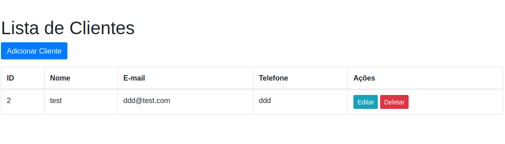
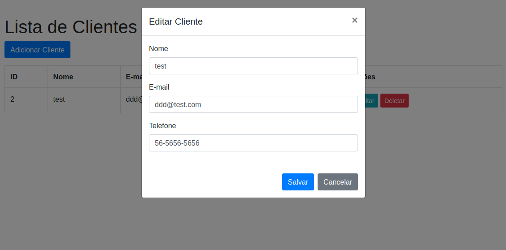

# test02
Esta aplicação CRUD em PHP utiliza MySQL e está configurada para ser executada em contêineres Docker. 
O código-fonte da aplicação encontra-se na pasta consolidai (equivalente a /var/www/html/consolidai dentro do contêiner).

Pré-requisitos

->Docker instalado
-> Docker Compose instalado

Instalação do Docker e Docker Compose

->Instale o Docker conforme seu sistema operacional.
-> Instale o Docker Compose se ainda não estiver instalado.

Estrutura do Projeto
project-root/
├── Dockerfile
├── docker-compose.yml
├── consolidai/         # Código da aplicação PHP
│   └── public/
│       └── index.php
├── config/
│   └── database.php
└── Outros arquivos

Passo a Passo para Executar a Aplicação com Docker
1. Clonar o Repositório

Abra um terminal (no Windows, PowerShell ou CMD; no Linux, um terminal padrão) e execute:

git clone https://github.com/devleojr/test02.git
cd test02

2. Construir e Iniciar os Contêineres

Na raiz do projeto, onde estão localizados o Dockerfile e o docker-compose.yml, execute:

docker-compose up --build -d
--build força a reconstrução das imagens caso haja mudanças.
-d inicia os contêineres em segundo plano.

3. Verificar se os Contêiner Está em Execução
Para verificar se os contêineres foram iniciados corretamente, utilize:
docker-compose ps

4. Acessar a Aplicação

Abra seu navegador e vá até:
http://localhost:8081

5. Parar os Contêineres
Para parar a aplicação e remover os contêineres (mantendo os volumes de dados intactos), execute:
docker-compose down

6. Remover Volume
Se precisar reiniciar completamente e limpar os dados do banco de dados, use:
docker-compose down -v

Considerações Adicionais

Recriação da Tabela:
A classe Client contém um método para criar a tabela clients se ela não existir. Isso garante que, ao iniciar a aplicação, a tabela seja criada automaticamente se necessário.
Atualizações no Código:
Sempre que fizer alterações no código ou nas configurações do Docker, reconstrua e reinicie os contêineres com:
docker-compose up --build -d

Compatibilidade:
Estes passos foram testados em ambientes Windows e Linux. Em sistemas Windows, utilize terminal compatível (como PowerShell ou CMD) com Docker Desktop instalado.

********************************************************************************************************************************************************************************
=================================== POR FAVOR SE HOUVER ALGUM ERRO ATUALIZE O NAVEGADOR 2 OU 3 VEZES PARA A APLICAÇÃO RODAR E ATUALIZAR O DOCKER ==============================
********************************************************************************************************************************************************************************

